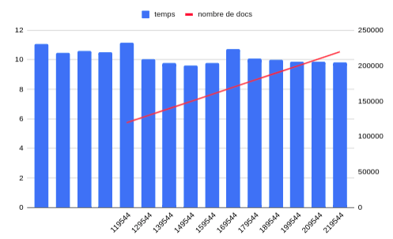

# MongoDB benchmark

```sh
# Reminder, run the mongo db 
sudo systemctl start mongod && sudo systemctl status mongod
``` 


## Test insertion 

```sh
console.time("insert all");

for ( i = 0 ; i  < 10000 ; i++  ) { 
    db.stringtest.insertOne({a: "testboucle"})  
} ;

console.timeEnd("insert all");

db.stringtest.countDocuments();
 
```
Results :
* `11.085`s
* `10.464`s
* `10.614`s
* `10.509`s

Moyenne : `10.668`s 

### Tests d'insertion plus il y a de données

Results:
* `11.164`s (119544)
* `10.052`s (129544)
* `9.794`s (139544)
* `9.608`s (149544)
* `9.785`s (159544)
* `10.712`s (169544)
* `10.092`s (179544)
* `9.978`s (189544)
* `9.879`s (199544)
* `9.853`s (209544)
* `9.840`s (219544)



Le temps d'insertion ne semble pas impacté par le nombre de document dans la base. 

## Test de lecture

```sh
var myCursor = db.stringtest.find({a: "testboucle"});

console.time("read");
let i = 0 ; 
while (myCursor.hasNext() && i< 50000) {
    # print(myCursor.next())
    myCursor.next()
    i++;
}
console.timeEnd("read");
 
```

* `1000` next() in `1.009`s : `1`ms
* `10000` next() in `7.871`s : `0.8`ms 
* `20000` next() in `15.018`s : `0.75`ms 
* `30000` next() in `21.942`s : `0.7`ms

Sans le print()

* `30000` next() in `12.776`s : `0.43`ms
* `50000` next() in `21.255`s : `0.425`ms


et le find() alors ?

```sh
console.time("find");
var myCursor = db.stringtest.find({a: "testboucle"});
console.timeEnd("find");
 
```
* `54.263`ms avec `219544` documents.
* `73.474`ms avec `269544` documents.
* `45.373`ms avec `369544` documents.

Le find ne semble pas impacté par la taille de la collection.